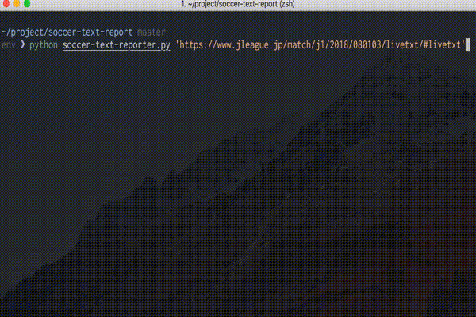

Soccer Text Report
===
Automated summary report creater by text report of Jleague web site (https://www.jleague.jp/)

Inspired by 【高校野球・兵庫大会】経過戦評ロボットくん｜神戸新聞NEXT  
https://www.kobe-np.co.jp/info/nextguide/koya2018summer/robot/

## Demo

## Final Output

[２－０でホームの浦和が勝利。Ｊ１通算４００勝を達成した]  
浦和は前半7分、岩波からのロングボールに武藤が抜け出す。持ち上がった武藤は右サイドの敵陣深くからグラウンダーで折り返すと、興梠が右足でチョンソンリョンの頭上を越えるループシュートを放ち、ゴールに吸い込まれる。浦和は後半47分、李が自陣からドリブルで持ち上がる。ペナルティエリア左に進入すると、鈴木にタックルで倒されてＰＫを獲得。キッカーはファブリシオ。チョンソンリョンの逆を突き、ゴール左に沈め、リードを広げる。２－０でホームの浦和が勝利。Ｊ１通算４００勝を達成した。

Japanese blog can be seen from the following link:  
https://upura.hatenablog.com/entry/2018/08/05/154425

## Usage
1. Search URL of match result page like https://www.jleague.jp/match/j1/2018/080103/livetxt/#livetxt 
1. Execute python code giving URL as a command line argument
1. Report is shown in the terminal

## Requirement
- Python 3.x
    - selenium

## Author

[upura](https://github.com/upura)
